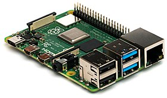

# **0. Introducción**

Repositorio de recursos para la configuracion y programacion de Raspberry Pi.

Repositorio en construccion

Raspberry Pi es un ordenador funcional pequeño y de bajo coste. Permite navegar por Internet, jugar con videojuegos, programar tus propios programas o dispositivos físicos,...

Raspberry PI 4B ([Wikipedia](https://es.wikipedia.org/wiki/Raspberry_Pi))

