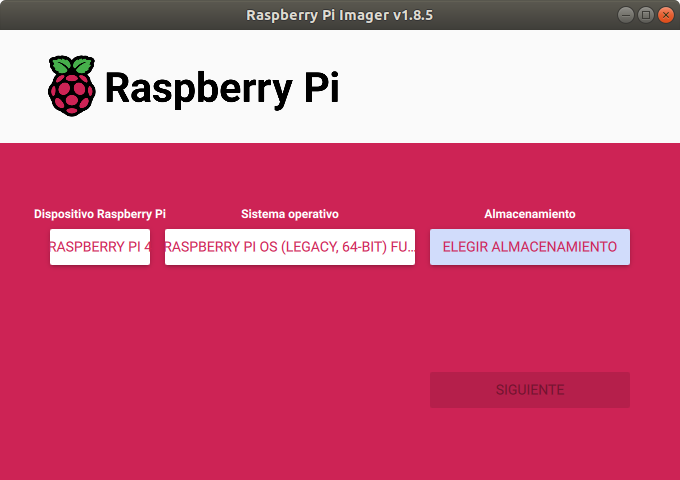

# **1. Instalación de S.O. en microSD para RPi 4B**
En los proyectos maker con la placa Raspberry Pi es interesante y cómodo controlarla de manera remota. Para prepararla se necesita un portátil, una Raspberry Pi (en este taller la RPi 4B) y su fuente de alimentación, una tarjeta microSD (16GB o más), software de grabación de tarjeta RPi Imager, software de comunicaciones PuTTY (protocolo SSH) y VNC (control remoto de escritorio), una red wifi (móvil con conexión wifi compartida) y la app Fing (opcional,buscador de IP en red local).

Recursos del taller

Fuentes de los contenidos:

[www.raspberrypi.com](https://www.raspberrypi.com/documentation/computers/getting-started.html)

[https://bricolabs.cc](https://bricolabs.cc/wiki/guias/guiadeinicioraspberrypi2021)

[https://aprendiendoarduino.wordpress.com](https://aprendiendoarduino.wordpress.com/2022/04/17/paso-a-paso-instalar-y-configurar-raspberry-pi-os)

###**1.1. Elección de la tarjeta micro SD**###
Para grabar el sistema operativo de la placa RPi la tarjeta micro SD tiene que tener una velocidad mínima de 10 Mb/seg y una capacidad de 8GB o más (los S.O. actuales neccesitan 16GB o más). Estas caracteristicas se obtiene de la serigrafía de la tarjeta como se ve en la siguiente imagen:

Características tarjeta micro SD

El sistema operativo para la placa Raspberry Pi se puede obtener en una tarjeta microSD con la aplicación NOOBS instalada (NOOBS facilita la instalación de diversas distribuciones Linux), instalando manualmente una imagen del S.O. que se descarga de la web oficial o utilizando la apliación más reciente **Raspberry Pi Imager**, fácil y cómoda de utilizar.

###**1.2. Grabación de Raspberry Pi OS con Raspberry Pi Imager**###

Para grabar **Raspberry Pi OS** en la tarjeta microSD (recomiendo una de 32GB) se descarga la apliacación [**Raspberry Pi Imager** (descargar)](https://www.raspberrypi.com/software/) para el sistema operativo de tu portátil.

[Raspberry Pi Imager v1.8.1](https://www.raspberrypi.com/software/)

Se instala en el ordenador y se arranca apareciendo una ventana como se ve en la imagen siguiente para seleccionar dispositivo, sistema operativo y tarjeta microSD, que se ha introduccido en el lector de tarjetas del ordenador.

Inicio Raspberry Pi Imager

Se seleciona la placa Raspberry Pi 4, cliqueando en la ventana emergente de **ELEGIR DISPOSITIVO**, y para seleccionar el sistema operativo (hay que dar varios pasos): cliqueando en **ELEGIR SO**-->**Raspberry Pi OS (other)**-->**Raspberry Pi OS (Legacy, 64-bit) Full**.

|            |            |
| ---------- | ---------- |
|||

Por último se cliquea en **ELEGIR ALAMCENAMIENTO** y se selecciona **Lector de tarjetas SD... 31,3GB**.

|            |            |
| ---------- | ---------- |
|||

Se activa la opción **SIGUIENTE** y se cliquea para continuar.

En este paso se va a **EDITAR AJUSTES** para personalizar el **usuario** y **contraseña** de la placa Raspberry Pi. También **Configurar LAN inalámbrica** que se crea con la conexión compartida del teléfono móvil y **Establecer ajustes regionales**.

|            |            |
| ---------- | ---------- |
|||

Por último se cliquea en la opción **SERVICIOS** para activar el protocolo de comunicaciones por consola SSH y se pulsar **GUARDAR**.

Ya se está preparado para grabar el S.O. en la tarjeta microSD pulsando la opción **SI**...

y se espera a que termine...

YA SE TIENE LO NECESARIO PARA IR AL TALLER!!!

Teniendo grabado en la tarjeta microSD el sistema operativo **Raspberry Pi OS (Legacy, 64-bit) Full** se inserta en el slot (ranura en la parte posterior) de la placa Raspberry Pi 4B...

Inserción de la tarjeta microSD a la placa Raspberry Pi

Para encender la placa, primero se conecta el conector USB tipo C del adaptador de tensión a la placa y después se enchufa a una toma de corriente. **En caso de conectar primero al enchufe y luego, el conector USB tipo C, a la Raspberry podríamos causar pequeños cortos que podrían afectar la vida útil de nuestra tarjeta**

Conexión de la alimentación a la placa Raspberry Pi

###**1.3. Detectar la IP de RPi**###
###**- con el móvil**###
Con el móvil configurado para **compartir conexión wifi** y la placa Raspberry Pi encendida con los ajustes realizados al sistema operativo, en el apartado anterior, se puede ver la IP de de la placa Raspberry PI.

Accediendo a ajustes del móvil de **Conexión Compartida** se obtiene la IP.

|            |            |            |
| ---------- | ---------- | ---------- |
||||
|**Sin conexión**|**Con conexión**|**IP de RPi**|

###**- con comandos en línea del sistema operativo**###

**En Linux:**

    1. En Linux abre el terminal, puedes usar el atajo Ctrl + Alt + T o buscar "Terminal" en tu gestor de aplicaciones.
    2. Usar el comando **ipconfig** para ver la dirección IP local.
    3. Usar el comando **nmap -sP [rango de IP]** para escanear la red y obtener una lista más completa de dispositivos conectados. Por ejemplo, nmap -sP 192.168.1.0/24 escaneará todos los dispositivos en la red 192.168.1.x.

**En Windows:**

    1. Abrir la consola o el símbolo del sistema (Cmd). Puedes hacerlo buscando "cmd" en el menú de inicio y seleccionando la aplicación "Símbolo del sistema".
    2. Ejecuta el comando: **arp -a**. Este comando muestra una tabla de direcciones IP y MAC de los dispositivos conectados a tu red local.
    3. Para obtener información más detallada, puedes usar el comando **ipconfig** para ver tu configuración de red y el comando **netstat -an** para ver las conexiones de red activas.

###**1.4. Conectar con PuTTY (SSH) y actualizar la RPi**###

Conociendo la **IP de la placa Raspberry Pi** se puede conectar en remoto por el protocolo SSH a la placa. Utilizando la conexión SSH se accede a la consola de comandos en línea que no va a permitir actualizar y cambiar la confiuración de la Raspberry Pi para acceder en modo gráfico.

Se necesita tener instalado en el portátil la aplicación **PuTTY**, emulador de terminal,que hay tanto para Linux como para Windows. [Descargar](https://www.putty.org/).

En Ubuntu es fácil instalarlo desde el **Gestor de software**

Instalación del emulador de terminal PuTTY

Si se hace desde el terminal de Linux ([aquí un tutorial](https://www.solvetic.com/tutoriales/article/13001-como-instalar-putty-en-linux/)).

En Windows se descarga desde la [web https://putty.org](https://www.chiark.greenend.org.uk/~sgtatham/putty/latest.html), descargando el archivo instalador .msi

Una vez instalado y ejecutado el emulador de terminal PuTTY aparece la pantalla y se pone la IP de la placa Raspberry Pi, en el cuadro de texto marcado en negro...

Configurar la conexión en PuTTY

Pulsando la opción **Open** aparece la ventana que primero pide el nombre de **usuario** y a continuación la **contraseña**. En los ajustes de la grabación se ha cambiado el usuario y contraseña. En el caso que no se haya cambiado el usuario sería **pi** y la contraseña **raspberry**.

Observando la última imagen, se puede interactuar con la placa a través de la línea de comandos.

Los comandos para actualizar el sistema operativo de la Rapsberry Pi son los siguientes:

- **sudo apt update**-

- **sudo apt upgrade**

En el proceso de actualización se va dando confirmación (si se pide) a la descarga de los archivos...

Proceso de actualización terminado

###**1.5. Activar VNC**###
Actualizado el sistema operativo, se ajusta la configuración para poder hacer la conexión remota al escritorio en modo gráfico.

A través de PuTTY se escribe el siguiente comando:

- **sudo raspi-config**

Aparecen la ventana de ajuste de configuración y con las teclas de **flechas** se desplaza a la opción a seleccionar, con la tecla **Tab** se seleciona, se vuelve atrás o se confirma.

|            |            |
| ---------- | ---------- |
|||
|||

Realizado los ajustes de configuración se tiene que **reiniciar** para asegurar los cambios.

###**1.6. Conectar VCN Viewer a RPi**###

Para conectar desde el portátil y conectarse por VNC a la RPI se tiene que instalar en el portátil la aplicación **VNC Viewer**.

Descargar en https://www.realvnc.com/es/connect/download/viewer/ e instalar.

Al arrancar la apliación **VNC Viewer** aparece la pantalla.

Pantalla de inicio de VNC Viewer

Se configura la conexión accediendo al menú de **Archivo** --> **Nueva conexión** o se escribe la IP en la parte superior. Se va poniendo el nombre de usuario y contraseña...

|            |            |
| ---------- | ---------- |
|||
|||

Se finaliza llegando al escritorio remoto gráfico.

Escritorio gráfico de RPI

