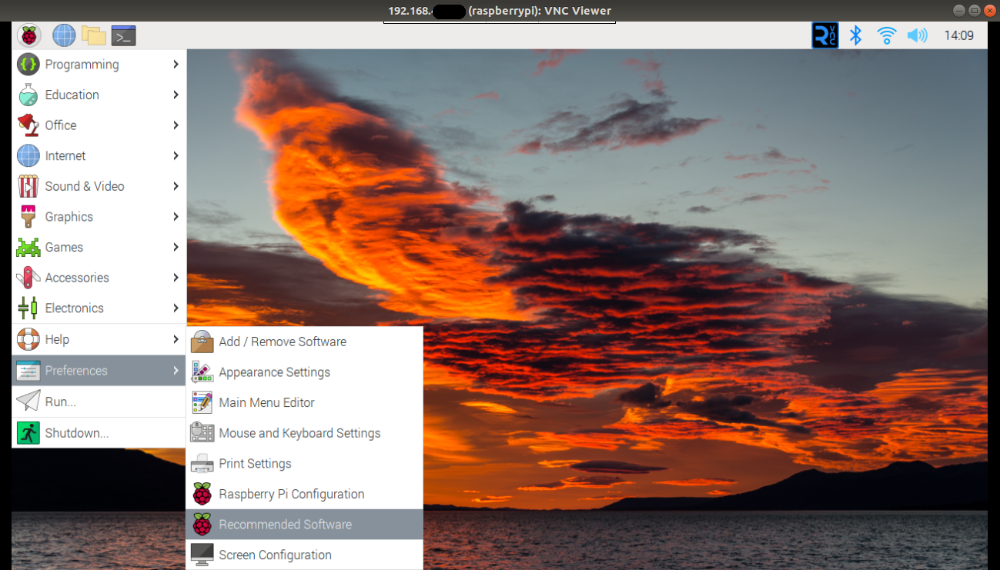
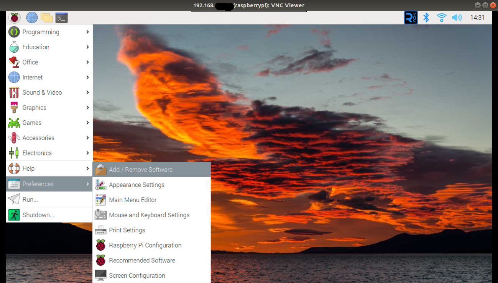
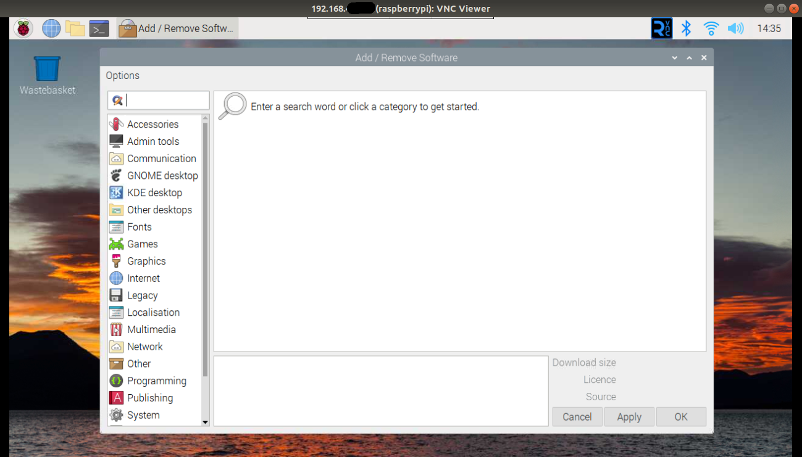

#**2. Software**

Raspberry Pi ejecuta una amplia variedad de programas de software y diversos sistemas operativos, que son el software principal que hace que un ordenador funcione.

El sistema operativo Raspberry Pi OS es el oficial de la Fundación Raspberry Pi. Se basa en Debian Linux y se ha adaptado especialmente paraRaspberry Pi.

###**2.1. Recommended Software**###

En la herramienta Recommended Software se encuentra una selección de programas recomendada por la Fundación Raspberry Pi.

Para localizar este software: haz clic en el menú de Raspberry, mueve el puntero del ratón a **Preferencias** y haz clic en **Recommended Software**.

Recommended Software

Al igual que el software en el menú de Raspberry, se organizan por categorías. Haz clic en una categoría en el panel de la izquierda para ver software de esa categoría. Hazclic en **All Programs** para ver todo el software.

Si un programa de software tiene una marca de verificación, indica que ya está instalado en tu Raspberry Pi. Si no, puedes hacer clic en la casilla correspondiente para poner la marca e indicar que debe instalarse.

También puedes desinstalar software mediante el mismo procedimiento: busca un programa que ya tenga una marca en la casilla de verificación y luego haz clic en la marca para eliminarla.

Cuando tengas la selección de software deseada, haz clic en el botón OK para iniciar el proceso de instalación o desinstalación. Después de descargar e instalar cualquier software nuevo que hayas elegido, aparecerá un cuadro de diálogo. Haz clic en OK para cerrar la herramienta Recommended Software.

###**2.2. Instalar y desinstalar software**###

El sistema operativo Raspberry Pi OS se suministra con una selección de populares paquetes de software elegidos por la Fundación Raspberry Pi, pero no son los únicos que funcionan en un Raspberry Pi. Se puede buscar software adicional, instalarlo y desinstalarlo de nuevo, para ampliar las capacidades de tu Raspberry Pi.

Instalar y desinstalar software

Para ver y buscar en la lista de paquetes de software disponibles para el sistema operativo Raspberry Pi, se usa los repositorios de software.

Repositorios de software por categorias

La instalación y desinstalación se software se hace como se ha explicado para **Recommended software**